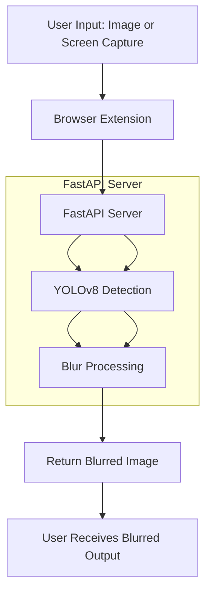

Below is an updated version of the `README.md` file that includes an explanation of the `dags/handgun_detection_pipeline.py` file, which defines an Apache Airflow DAG (Directed Acyclic Graph) for orchestrating the handgun detection MLOps pipeline. I've added a new section for DAGs, updated the folder structure, and included a description of the file under "File Descriptions."

```markdown
# Gun Detection and Blurring Pipeline

This project implements a gun detection system using the YOLOv8 model, integrated with a FastAPI backend to process images and blur detected guns. The solution is designed to be deployed as a browser extension or API service, with hosting capabilities on Ubicloud and an MLOps pipeline managed by Apache Airflow. This README provides an overview of the pipeline, setup instructions, and deployment details.

## Table of Contents
- [Project Overview](#project-overview)
- [Pipeline Workflow](#pipeline-workflow)
- [Technology Stack](#technology-stack)
- [Folder Structure](#folder-structure)
- [File Descriptions](#file-descriptions)
- [DVC Configuration (dvc.yaml)](#dvc-configuration-dvcyaml)
- [Airflow DAGs Configuration (dags/handgun_detection_pipeline.py)](#airflow-dags-configuration-dagshandgun_detection_pipelinepy)
- [Setup Instructions](#setup-instructions)
- [Deployment on Ubicloud](#deployment-on-ubicloud)
- [Usage](#usage)
- [Contributing](#contributing)
- [License](#license)

## Project Overview

The project aims to detect guns in images using a custom-trained YOLOv8 model and apply a blur effect to obscure them. The system includes:
- **Training**: A YOLOv8 model trained on a dataset of images containing guns.
- **API**: A FastAPI server that processes image uploads, performs detection, and returns blurred images.
- **Extension**: A JavaScript browser extension to capture screen content and integrate with the API.
- **Hosting**: Deployment on Ubicloud for scalable and accessible service.
- **MLOps**: Apache Airflow for automating the training, versioning, and deployment pipeline.

The primary use case is to enhance privacy and safety by automatically blurring detected guns in real-time or uploaded images.

## Pipeline Workflow

The pipeline consists of several stages, from image input to blurred output. Below is a Mermaid diagram representing the workflow:



### Detailed Workflow
1. **User Input**:
   - The process begins with an image or screen capture, either uploaded manually or captured via a browser extension.
   
2. **Browser Extension**:
   - The JavaScript extension captures the screen or processes an uploaded image, sending it to the FastAPI server via a POST request.

3. **FastAPI Server**:
   - The server receives the image, converts it to a format suitable for processing, and passes it to the YOLOv8 model.

4. **YOLOv8 Detection**:
   - The trained YOLOv8 model (`last.pt`) analyzes the image, identifying bounding boxes around detected guns.

5. **Blur Processing**:
   - OpenCV applies a Gaussian blur to the regions within the bounding boxes, obscuring the detected guns while preserving the rest of the image.

6. **Return Blurred Image**:
   - The server converts the processed image back to a PNG format and returns it as a binary response to the client.

7. **User Receives Blurred Output**:
   - The browser extension or client application displays or saves the blurred image for the user.

## Technology Stack

- **Machine Learning**: YOLOv8 (via `ultralytics`) for object detection.
- **Backend**: FastAPI for building the API server.
- **Image Processing**: OpenCV (`cv2`) for blur application, PIL for image handling.
- **Frontend**: JavaScript for the browser extension (Chrome-compatible).
- **Hosting**: Ubicloud for cloud deployment.
- **Data Versioning**: DVC for managing datasets and pipelines.
- **MLOps**: Apache Airflow for pipeline orchestration.
- **Dependencies**: Python, `requests`, `numpy`, `torch`, `uvicorn`, `dvc`, `apache-airflow`.

## Folder Structure

```
gun-detection-project/
│
├── content/                    # Directory for model weights and runs
│   └── runs/                   # YOLOv8 training run outputs
│       └── detect/             # Detection model runs
│           └── yolov8n_gun/    # Specific run for gun detection
│               └── weights/    # Model weights
│                   ├── last.pt # Latest trained model
│                   └── best.pt # Best trained model (optional)
│
├── data/                       # Directory for raw and processed datasets
│   ├── raw/                    # Raw dataset images
│   └── processed/              # Processed dataset (e.g., annotated images)
│
├── Gun-Detect-Ops/             # Directory for Airflow DAGs
│   └── dags/                   # Airflow DAG definitions
│       └── handgun_detection_pipeline.py # Airflow DAG for the pipeline
│
├── src/                        # Source code for training and data processing
│   ├── train.py                # Training logic and model management
│   └── prepare_data.py         # Data preparation script
│
├── gun_main.py                 # FastAPI server script
├── check_test.py               # Test script for API
├── Dockerfile                  # Docker configuration for deployment
├── deploy.yaml                 # Kubernetes deployment configuration for Ubicloud
├── requirements.txt            # Python dependencies
├── dvc.yaml                    # DVC pipeline configuration
├── README.md                   # Project documentation
├── LICENSE                     # License file
└── .gitignore                  # Git ignore file
```

## File Descriptions

- **`content/runs/detect/yolov8n_gun/weights/last.pt`**:
  - The latest trained YOLOv8 model weights file used for gun detection. This file is generated after training the model on a dataset of gun images.

- **`content/runs/detect/yolov8n_gun/weights/best.pt`** (optional):
  - The best-performing model weights from the training process, selected based on validation metrics. Used as an alternative to `last.pt` if available.

- **`data/raw/`**:
  - Contains the raw dataset images used for training the YOLOv8 model.

- **`data/processed/`**:
  - Stores processed dataset files, such as annotated images with bounding boxes for gun detection.

- **`Gun-Detect-Ops/dags/handgun_detection_pipeline.py`**:
  - Defines an Apache Airflow DAG that orchestrates the handgun detection pipeline. It includes tasks for loading configuration, downloading the dataset, training the model, versioning with DVC, and deploying with Docker.

- **`src/train.py`**:
  - Contains functions for loading configuration, downloading datasets, training the YOLOv8 model, and saving the trained model. Used by the Airflow DAG.

- **`src/prepare_data.py`**:
  - A script for preprocessing raw data (e.g., annotating images) and saving it to `data/processed`. Integrated into the DVC pipeline.

- **`gun_main.py`**:
  - The main FastAPI application script that defines the `/detect/` endpoint. It loads the YOLOv8 model, processes uploaded images, detects guns, applies blur, and returns the blurred image as a PNG response.

- **`check_test.py`**:
  - A Python script to test the FastAPI API locally. It sends a test image to the `/detect/` endpoint and saves the blurred output.

- **`Dockerfile`**:
  - Defines the Docker container configuration, specifying the Python environment, dependencies, and the command to run the FastAPI server.

- **`deploy.yaml`**:
  - A Kubernetes deployment and service configuration file for deploying the application on Ubicloud. It includes settings for replicas, container image, and port mapping.

- **`requirements.txt`**:
  - Lists all Python dependencies required to run the project, including FastAPI, Uvicorn, Ultralytics, Pillow, NumPy, OpenCV, DVC, and Apache Airflow.

- **`dvc.yaml`**:
  - Defines the DVC pipeline for managing the dataset and training process. It specifies stages like data preparation, model training, and evaluation.

- **`README.md`**:
  - This file, providing an overview, workflow, setup instructions, deployment details, file descriptions, DVC configuration, and Airflow DAG explanation.

- **`LICENSE`**:
  - Contains the MIT License terms governing the use and distribution of the project.

- **`.gitignore`**:
  - Specifies files and directories (e.g., `.pyc`, `__pycache__`, virtual environments) to be ignored by Git.

## DVC Configuration (dvc.yaml)

DVC (Data Version Control) is used to manage the dataset and automate the machine learning pipeline. The `dvc.yaml` file defines the stages of the pipeline, ensuring reproducibility and versioning of data and models.

### Example `dvc.yaml`
```yaml
stages:
  prepare_data:
    cmd: python src/prepare_data.py
    deps:
      - data/raw
    outs:
      - data/processed

  train_model:
    cmd: python src/train.py --model yolov8n --data data/processed
    deps:
      - data/processed
      - src/train.py
    params:
      - train.epochs
      - train.batch_size
    outs:
      - content/runs/detect/yolov8n_gun/weights/last.pt

  evaluate_model:
    cmd: python src/evaluate_model.py --weights content/runs/detect/yolov8n_gun/weights/last.pt
    deps:
      - content/runs/detect/yolov8n_gun/weights/last.pt
      - data/processed
    metrics:
      - metrics.json
```

### Explanation
- **`stages`**: Defines the pipeline stages.
  - **`prepare_data`**: Preprocesses raw images (e.g., annotating with bounding boxes) and saves them to `data/processed`. Depends on `data/raw` and outputs to `data/processed`.
  - **`train_model`**: Trains the YOLOv8 model using the processed data. Depends on `data/processed` and the training script, with parameters like epochs and batch size, and outputs the `last.pt` model.
  - **`evaluate_model`**: Evaluates the trained model and saves metrics to `metrics.json`. Depends on the model weights and processed data.
- **`cmd`**: The command to execute for each stage.
- **`deps`**: Input dependencies for the stage.
- **`outs`**: Output files or directories generated by the stage.
- **`params`**: Configuration parameters (stored in a `config.yaml` file, e.g., `train.epochs: 100`).
- **`metrics`**: Files containing evaluation metrics.

### Setup DVC
1. Install DVC:
   ```bash
   pip install dvc
   ```
2. Initialize DVC:
   ```bash
   dvc init
   ```
3. Track data and models:
   ```bash
   dvc add data/raw
   dvc add content/runs/detect/yolov8n_gun/weights
   git add .dvc .gitignore
   git commit -m "Initialize DVC"
   ```
4. Run the pipeline:
   ```bash
   dvc repro
   ```

## Airflow DAGs Configuration (dags/handgun_detection_pipeline.py)

Apache Airflow is used to automate and orchestrate the handgun detection pipeline, including data preparation, model training, versioning, and deployment. The `Gun-Detect-Ops/dags/handgun_detection_pipeline.py` file defines a DAG that schedules and manages these tasks.

### DAG Code
```python
from airflow import DAG
from airflow.operators.python import PythonOperator
from airflow.operators.bash import BashOperator
from datetime import datetime, timedelta
import os
import sys

sys.path.append(os.path.join(os.path.dirname(__file__), '..', 'src'))
from train import load_config, download_dataset, train_model, save_model

def load_config_wrapper():
    config = load_config("../config.yaml")
    return config

def download_task(**kwargs):
    config = kwargs['ti'].xcom_pull(task_ids='load_config')
    dataset_path = download_dataset(config)
    kwargs['ti'].xcom_push(key='dataset_path', value=dataset_path)

def train_task(**kwargs):
    config = kwargs['ti'].xcom_pull(task_ids='load_config')
    dataset_path = kwargs['ti'].xcom_pull(task_ids='download_dataset', key='dataset_path')
    model = train_model(dataset_path, config)
    save_model(model, config)

default_args = {
    'owner': 'airflow',
    'depends_on_past': False,
    'email_on_failure': False,
    'email_on_retry': False,
    'retries': 1,
    'retry_delay': timedelta(minutes=5),
}

with DAG(
    'handgun_detection_pipeline',
    default_args=default_args,
    description='Handgun Detection MLOps Pipeline',
    schedule_interval=timedelta(days=1),  
    start_date=datetime(2025, 4, 6),
    catchup=False,
) as dag:
    t0 = PythonOperator(
        task_id='load_config',
        python_callable=load_config_wrapper,
        provide_context=True,
    )

    t1 = PythonOperator(
        task_id='download_dataset',
        python_callable=download_task,
        provide_context=True,
    )

    t2 = PythonOperator(
        task_id='train_model',
        python_callable=train_task,
        provide_context=True,
    )

    t3 = BashOperator(
        task_id='push_to_dvc',
        bash_command='dvc add data models && dvc push',
    )

    t4 = BashOperator(
        task_id='build_docker',
        bash_command='docker build -t handgun-detection-api:latest .',
    )

    t5 = BashOperator(
        task_id='run_docker',
        bash_command='docker run -d -p 8000:8000 handgun-detection-api:latest',
    )

    t0 >> t1 >> t2 >> t3 >> t4 >> t5
```

### Explanation
- **DAG Definition**:
  - The DAG is named `handgun_detection_pipeline` and runs daily (`schedule_interval=timedelta(days=1)`), starting from April 6, 2025 (`start_date`).
  - `default_args` sets general configurations like owner, retries, and retry delay.

- **Tasks**:
  - **`load_config`**:
    - A PythonOperator that loads configuration from `config.yaml` using `load_config_wrapper`. The config is passed to subsequent tasks via XCom.
  - **`download_dataset`**:
    - A PythonOperator that downloads the dataset based on the configuration and stores the dataset path in XCom.
  - **`train_model`**:
    - A PythonOperator that trains the YOLOv8 model using the dataset and config, then saves the model.
  - **`push_to_dvc`**:
    - A BashOperator that adds the dataset and model to DVC and pushes them to remote storage.
  - **`build_docker`**:
    - A BashOperator that builds a Docker image for the FastAPI server.
  - **`run_docker`**:
    - A BashOperator that runs the Docker container, exposing it on port 8000.

- **Task Dependencies**:
  - Tasks are sequenced with `>>`, ensuring `load_config` runs first, followed by `download_dataset`, `train_model`, `push_to_dvc`, `build_docker`, and finally `run_docker`.

### Setup Airflow
1. Install Airflow:
   ```bash
   pip install apache-airflow
   ```
2. Initialize Airflow:
   ```bash
   airflow db init
   airflow webserver --port 8080
   airflow scheduler
   ```
3. Add the DAG file to the `dags/` folder and monitor it via the Airflow web interface.

## Setup Instructions

### Prerequisites
- Python 3.8+
- Git
- Node.js (for extension development, optional)
- DVC (for data versioning)
- Apache Airflow (for pipeline orchestration)

### Installation
1. **Clone the Repository**:
   ```bash
   git clone https://github.com/username/repository.git
   cd repository
   ```

2. **Install Dependencies**:
   ```bash
   pip install fastapi uvicorn ultralytics pillow numpy opencv-python requests dvc apache-airflow
   ```

3. **Prepare the Model**:
   - Ensure your trained YOLOv8 model (`last.pt`) is placed in `content/runs/detect/yolov8n_gun/weights/`.
   - If not trained, set up DVC and Airflow to run the pipeline.

4. **Run the Server Locally**:
   ```bash
   uvicorn gun_main:app --reload
   ```
   - The server will be available at `http://127.0.0.1:8000`.

5. **Test the API**:
   - Use the provided `check_test.py` script or a tool like `curl`:
     ```bash
     curl -X POST -F "image=@test.jpg" http://127.0.0.1:8000/detect/ -o blurred_output.jpg
     ```

## Deployment on Ubicloud

Ubicloud is a cost-effective cloud platform that supports containerized applications. Here's how to deploy the FastAPI server:

### Prerequisites
- Ubicloud account and CLI installed (`ubctl`).
- Docker installed on your local machine.

### Deployment Steps
1. **Containerize the Application**:
   - Create a `Dockerfile` in the project root:
     ```Dockerfile
     FROM python:3.9-slim

     WORKDIR /app

     COPY requirements.txt .
     RUN pip install --no-cache-dir -r requirements.txt

     COPY . .

     CMD ["uvicorn", "gun_main:app", "--host", "0.0.0.0", "--port", "8000"]
     ```

   - Create a `requirements.txt`:
     ```
     fastapi
     uvicorn
     ultralytics
     pillow
     numpy
     opencv-python
     ```

2. **Build the Docker Image**:
   ```bash
   docker build -t gun-detection-api .
   ```


## License

This project is licensed under the MIT License. See the [LICENSE](LICENSE) file for details.
```
